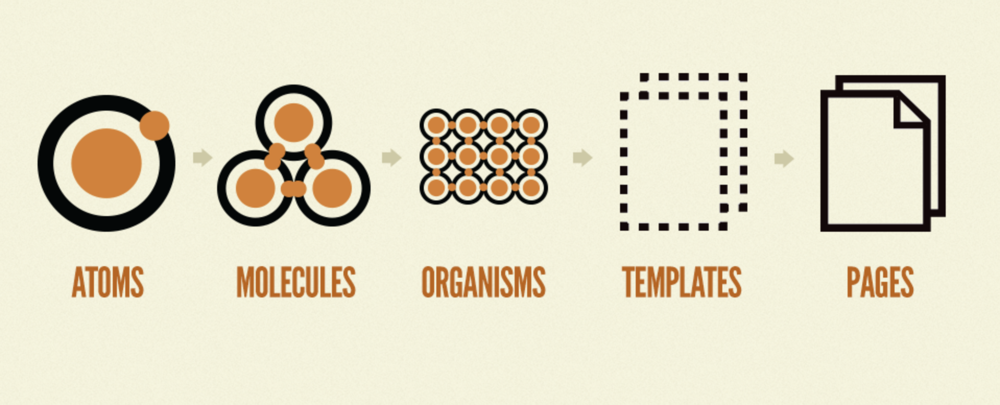
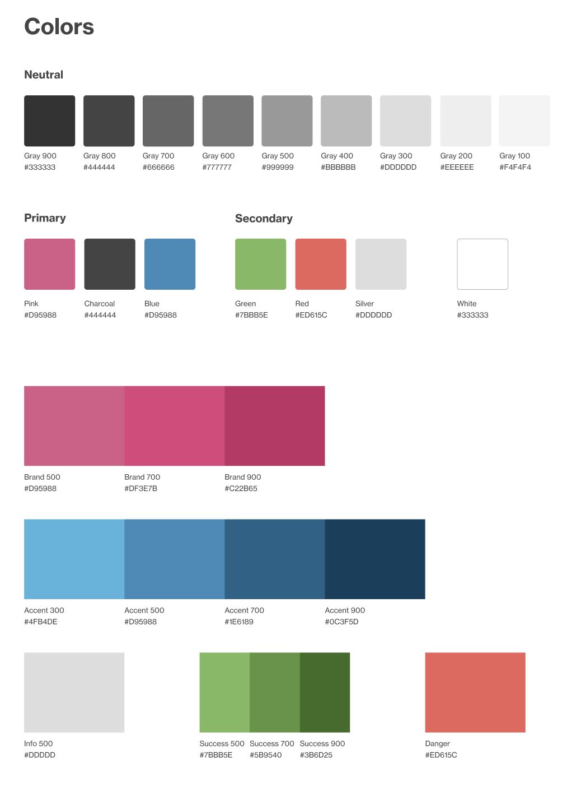
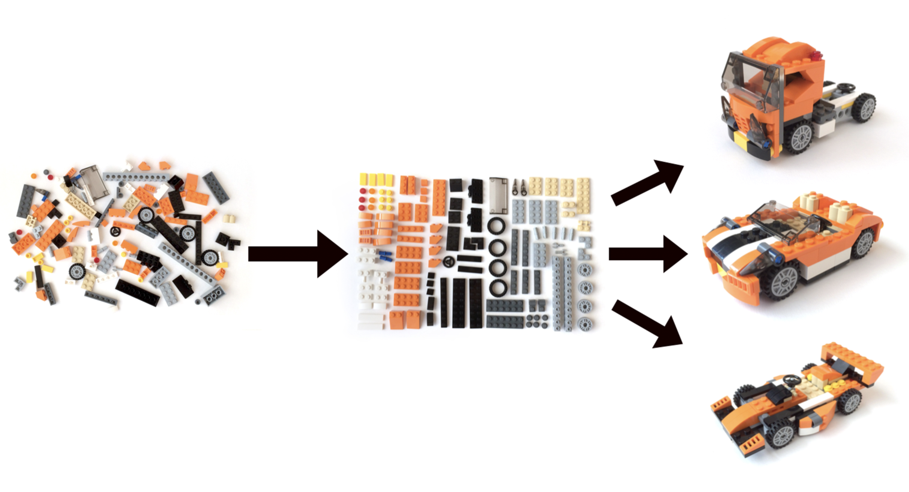

## Agenda


Section|Type
-----|-----
Setup|Topic
Introduction to design systems|Topic
E1: Inventory|Exercise
Intro to tokens|Topic
Tokens in Figma|Exercise
Code tokens with sass variables|Exercise
Components|Topic
Create an Atom in Figma|Exercise
Components in React|Exercise
Build an Atom with React|Exercise
Exercise with Molecules - Figma|Exercise
Exercise with Molecules - React|Exercise
Spec work|Exercise

## Setup

* Setup notes: https://www.notion.so/f06d2d9eee0c4a25a1202efac205b3c0?v=72b8f3ae27474dbd952ecdbce9116dfa
* How to install fonts: https://support.apple.com/en-us/HT201749
* DSL workshop git repo: 
    ```
    git clone https://github.com/siddharthkp/dsl-workshop.git
    cd dsl-workshop
    yarn install
    yarn storybook
    ```

## Intro to Design Systems

* Atom Design: 


* For MVP, YLD created the following:
    - Design assets
    - Component library
    - Documentation
        * Design decisions
        * Component usage
*  Some examples of design system:
    Name|Style|Link
    -----|---|--
    Shopify's Polaris | Strict and enforcing| https://polaris.shopify.com/
    Atlassian's Atlaskit | Loose and consulting | https://atlaskit.atlassian.com/
    Auth0's cosmos | WIP | https://auth0-cosmos.now.sh/docs/#/ 

## Inventory

* Take screenshots of your system
* Identify common UI patterns on the screenshots. Draw a box around them and give them a meaningful name
* Cut them up and group them by functionality. One group can be called "Buttons"
* Here are some tools to explore:
    - Designing assets
        * Sketch: https://www.sketch.com/
        * Figma: https://www.figma.com/downloads/
    - Exporting assets to  understand specifications
        * Zeplin: https://support.zeplin.io/en/articles/1067477-exporting-designs-from-sketch 
    - Design version control: 
        * Abstract: https://www.abstract.com/ 
    - Design tool to React native
        * BuilderX: https://builderx.io/
    - Export sketch to react
        * Sketch 2 React: https://sketch2react.io/

## Tokens

* Token are the sub-atomic part of the design system
* Define a variable for borders, spacing, size, colour... everything!
* As a developer, one should ALWAYS use the tokens and never hardcode the hex value / pixels
* Tokens explained: https://medium.com/eightshapes-llc/tokens-in-design-systems-25dd82d58421
* Tokens used in Salesforce: https://www.lightningdesignsystem.com/design-tokens/#category-background-color 
* Exercise link: https://www.figma.com/file/yunzLp8TTXNZ2CaV2mWK4S/E2-Tokens?node-id=30%3A0 
* Completed exercise: https://www.figma.com/file/h3Gru6pOq0U2nDVDEUQGwV/E3%3A-Code-Tokens?node-id=30%3A0 
*  Screenshot of the colour palettes: 


## Tokens in Figma

* Replicating Figma values into CSS. Example abstractions:
    ```
    --pink-500: #D95988;
    --pink-700: #DF3E7B;
    --pink-900: #C22B65;
    --color-brand-300: var(--pink-300);
    --color-brand-500: var(--pink-500);
    --color-brand-700: var(--pink-700);
    ```

* Tools for:
    - Visual regression testing- yes!
    - CI breaking: No :(
    - Style lint: https://github.com/stylelint/stylelint 


## Components

* Brad Frost explanation: http://atomicdesign.bradfrost.com/chapter-2/
* Here is a visual example of hhow atomic design should assit: 

* Structures
    - Atoms
        * Links
        * Buttons
        * Input
    - Molecules
    


